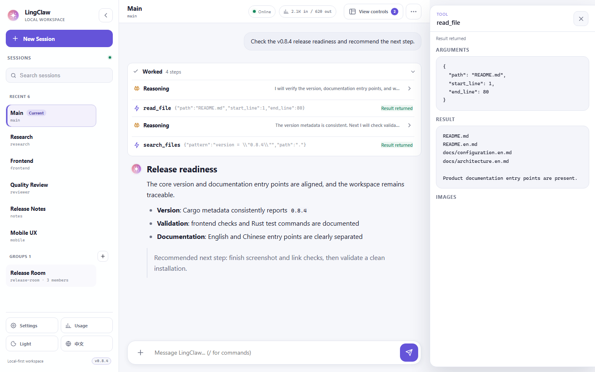
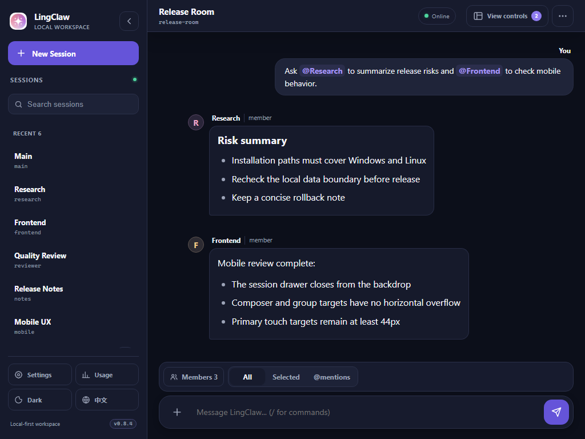
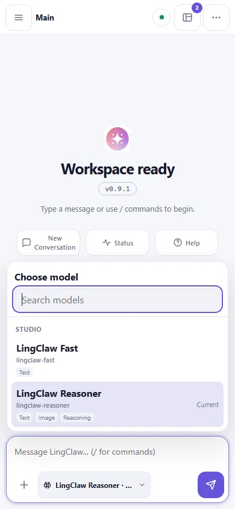
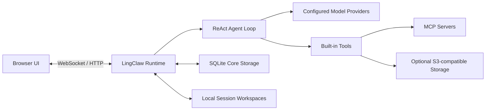

# LingClaw

<p align="center">
  
</p>

<p align="center">
  <strong>A local, Rust-powered workspace for personal AI agents.</strong><br>
  Connect your models, tools, skills, and sessions in one controlled loop for reasoning, execution, and collaboration.
</p>

<p align="center">
  <a href="README.md">简体中文</a> · <a href="README.en.md">English</a>
</p>

<p align="center">
  
  
  
</p>

<p align="center">
  
</p>

LingClaw brings model routing, tool execution, isolated workspaces, memory, MCP, and multi-agent collaboration into one local service. The browser provides the interface while the Rust runtime owns state, boundaries, and persistence. You choose the providers, tools, and model assigned to each agent.

> LingClaw is designed for a single user on the local machine and listens on `127.0.0.1` by default. It is not an authenticated, public multi-user service.

## Quick start

### Prerequisites

- Git and network access to Rust, Node.js, and the model providers you choose.
- PowerShell 5.1 or newer on Windows; Bash on Linux.
- The installers check Rust, its native linker, and Node.js `>= 20.19.0`. On Windows, the installer detects a missing MSVC C++ Build Tools workload before compiling and offers to install it through `winget`; if Node.js cannot be prepared, it can use the prebuilt frontend when a valid `static/` bundle is present.

### Windows

```powershell
git clone https://github.com/Linkq123/LingClaw.git
cd LingClaw
powershell -ExecutionPolicy Bypass -File .\scripts\install-windows.ps1
```

### Linux

```bash
git clone https://github.com/Linkq123/LingClaw.git
cd LingClaw
bash scripts/install-linux.sh
```

The scripts build the Rust backend and current frontend, then install the bundled skills and sub-agents. For this quick start, choose `Install`; also accept the PATH registration prompt if you want to run `lingclaw` by name in future shells.

The installer runs in a child process, so the current shell does not inherit its temporary PATH update. After accepting PATH registration, reopen the terminal and run:

```bash
lingclaw
```

To start immediately without reopening the terminal, invoke LingClaw from the Cargo installation directory:

```powershell
$cargoHome = if ($env:CARGO_HOME) { $env:CARGO_HOME } else { Join-Path $HOME '.cargo' }
& (Join-Path $cargoHome 'bin\lingclaw.exe')
```

```bash
"${CARGO_HOME:-$HOME/.cargo}/bin/lingclaw"
```

The first launch opens the Setup Wizard. Before regular chat is enabled, configure both of the following explicitly:

1. Add at least one model provider and model.
2. Assign a `primary` model to the main agent, or use `/model` to select a configured model for the current session.

LingClaw never silently starts a regular agent run with a built-in fallback model. After configuration and startup, open [http://127.0.0.1:18989](http://127.0.0.1:18989).

The composer distinguishes each recovery path:

- When no provider or model is configured, it opens Settings → Models.
- When the agent `primary` is missing, it opens Settings → Agents.
- When the current session override is invalid, it prepares `/model ` so you can choose again.

All three states disable regular sending while keeping status, help, and settings commands available. No request is sent to an unknown model.

Common service commands:

```bash
lingclaw start
lingclaw stop
lingclaw restart
lingclaw status
lingclaw doctor
lingclaw update
lingclaw db status
lingclaw db backup
```

Sessions, groups, messages, todos, usage, and sub-agent snapshots live in `~/.lingclaw/lingclaw.db`. On upgrade from the JSON store, LingClaw validates and migrates the old `sessions/` and `groups/` directories before opening its listener. The originals remain permanently under `~/.lingclaw/backups/sqlite-migration-*/`; LingClaw does not dual-write them.

See the [deployment guide](docs/deploy.en.md) for installation details, systemd, Docker, and reverse proxies.

## What you can do with LingClaw

### Complete work through a controlled agent loop

LingClaw organizes every run as an `Analyze → Act → Observe → Finish` ReAct state machine. Reasoning, tool calls, plans, sub-agents, and orchestration appear in an expandable execution stack. You can inspect the process, review tool output, add delayed guidance, or stop a run immediately.

The composer exposes per-session Execute and Plan modes. Plan Mode performs read-only analysis, asks only blocking questions, and produces a versioned artifact with steps, risks, and acceptance criteria. Once approved, the runtime injects that exact revision into every execution cycle and records step progress and deviations. Changed workspace evidence requires a refresh or explicit override, and approval never fabricates a user message. Plan Mode is currently unavailable in groups.

### Route work across models and protocols

The same session and tool system supports:

- OpenAI-compatible Chat Completions
- OpenAI Responses
- Anthropic Messages
- Gemini
- Ollama

Models use `provider/model` routing. Primary, Fast, Sub-agent, Memory, Reflection, and Context roles can use different models, while each session may persist its own `/model` override.

### Isolate context with sessions and collaborate through groups

Each session owns its workspace, prompt files, history, todos, memory, and capability settings. Groups organize multiple sessions into a shared conversation with broadcast, selected-target, and precise `@session-id` modes. The UI shows friendly names while the protocol keeps stable IDs.

### Extend capabilities with built-in tools, MCP, and skills

LingClaw includes tools for files, commands, search, networking, todos, and conditional image viewing. Its MCP client connects to stdio and Streamable HTTP servers, with per-session authorization for tools, resources, and prompts. Skills use `SKILL.md` to provide discoverable and overridable domain workflows.

### Delegate work to sub-agents

Use `task` for a single delegation and `orchestrate` for dependency-aware DAG execution. Bundled agents cover exploration, research, frontend, backend, general implementation, and review. Every sub-agent runs inside its own controlled loop with explicit model and tool boundaries.

### Retain memory and work with visual input

Sessions can maintain a human-readable `MEMORY.md`, daily notes, optional Structured Memory, and Daily Reflection. With S3-compatible storage and an image-capable model, user attachments, MCP images, and `view_image` results can enter the next model request. Raw tool Base64 is never written to logs, WebSocket events, or SQLite.

## Product experience

### A readable execution trail

Reasoning, Tool, Task Plan, Sub-agent, and Orchestration steps share one execution stack. Completed runs retain a compact summary; expanded runs reveal every step. Arguments, results, and images live in a separate inspector instead of crowding the conversation.

### Group conversations built for coordination

<p align="center">
  
</p>

The group context bar provides All, Selected, and @mention dispatch modes. Main is the permanent owner, while missing models, member status, governance actions, and mention targets remain explicit in the interface.

### A complete mobile layout

<p align="center">
  
</p>

Session navigation becomes a full-screen drawer on phones, tool details become a bottom sheet, and the composer respects safe areas and multiline content. Critical touch targets remain at least 44px, with keyboard navigation, focus return, and reduced-motion support intact.

### Full-screen Console and visual Usage

Settings and Usage live in a dedicated full-screen LingClaw Console that switches at the same level as the workspace. Desktop layouts use sidebar navigation, while narrow screens use a compact category picker. Switching categories preserves drafts in visited views, returning to the workspace restores focus, and transitions respect the system reduced-motion preference.

Models are presented as searchable cards with Provider and capability filters, while a responsive inspector concentrates connection and model fields. Other settings continue to use one runtime configuration snapshot with validation and concurrent-edit conflict reporting. Usage is scoped to the current Session and visualizes 7-, 14-, or 30-day Token trends, input/output composition, Provider and Agent role rankings, plus today, lifetime, daily-average, and active-day metrics. Accessible local SVG charts handle empty and partial data independently.

## How it works



- **Browser UI** — Responsive workspace for session navigation, streaming messages, and execution stacks, with Settings and Usage managed in the full-screen Console.
- **Runtime** — A single Rust process that manages WebSockets, configuration snapshots, concurrent sessions, group dispatch, and persistence.
- **SQLite** — `~/.lingclaw/lingclaw.db` is the only persistent source for sessions, messages, todos, usage, sub-agent snapshots, and groups; configuration and workspace files remain on the filesystem.
- **Agent Loop** — Selects a model, invokes tools, absorbs observations, and finishes within explicit phases and limits.
- **Workspace** — Stored at `~/.lingclaw/<session-id>/workspace/` by default, containing prompts, skills, agents, and memory.

See the [architecture guide](docs/architecture.en.md) for modules, provider conversion, security boundaries, and persistence.

## Data and security boundaries

| Data | Default location or destination | When it leaves the machine |
|---|---|---|
| Configuration and credentials | `~/.lingclaw/` | The whole file is not synchronized automatically; credentials are sent to the corresponding provider, MCP server, or S3 service for authentication |
| Sessions, groups, messages, todos, and usage | `~/.lingclaw/lingclaw.db` | The database is not synchronized automatically; relevant content is sent to your selected provider when it enters model context |
| Workspace prompts, skills, agents, and memory files | `~/.lingclaw/<session-id>/workspace/` | Sent to your selected provider when injected into model context |
| Prompts, conversations, and tool observations | Current session and runtime | Sent to your selected provider as model-request content |
| User attachments and tool images | Optional S3-compatible storage | Uploaded only when S3 and image capability are enabled |
| MCP data | The corresponding MCP server | Determined by the servers and tools you enable |

- The web service binds to `127.0.0.1` by default and does not listen directly on a LAN or public interface.
- Configuration, SQLite core data, and session workspaces stay under `~/.lingclaw/`; LingClaw does not automatically synchronize the complete archive.
- Use `lingclaw db backup [PATH]` for a consistent live SQLite snapshot. A complete disaster-recovery backup must also include configuration, MCP authentication, and workspace files.
- Model requests may contain system prompts, conversation history, tool observations, and todo or memory content injected into context. This content is sent to the model providers you configure, whose data policies apply.
- Local image uploads and tool-image feedback require optional S3-compatible storage. OpenAI and Anthropic require signed URLs reachable by the provider; Gemini and Ollama images are fetched by LingClaw locally.
- File tools stay inside the current session workspace. Network tools perform SSRF checks and reject redirects. Command tools apply dangerous-command checks and timeouts.
- MCP tools are controlled by the current session policy, and tools that may change external state can require confirmation.

LingClaw can execute commands and edit workspace files. Review its tool permissions and protect credentials stored in `.lingclaw.json`, just as you would with any local development agent.

## Documentation

| Document | Contents |
|---|---|
| [User guide](docs/user-guide.en.md) | Sessions, groups, commands, tools, skills, sub-agents, memory, and images |
| [Configuration](docs/configuration.en.md) | Providers, models, agent routing, MCP, S3, and environment variables |
| [Deployment](docs/deploy.en.md) | Windows, Linux, systemd, Docker, and reverse proxies |
| [Architecture](docs/architecture.en.md) | ReAct loop, module ownership, providers, security, and persistence |
| [Backend API](docs/backend-api.md) | HTTP API, WebSocket events, and errors — currently in Chinese |
| [Bundled skills](docs/system-skills.en.md) | Skills distributed with LingClaw |

See [`.lingclaw.json.example`](.lingclaw.json.example) for the canonical modern JSON configuration example.

## Development

### Backend

```bash
cargo fmt --check
cargo clippy --all-targets --all-features
cargo test
cargo build
```

### Frontend

```bash
cd frontend
npm ci
npm run typecheck
npm test
npm run lint
npm run fmt:check
npm run build
```

Frontend source lives in `frontend/`, and Vite writes its build to `static/`. Running only `cargo install --path .` does not automatically deploy those assets or the bundled skills and sub-agents beside the binary. Prefer the repository scripts or `lingclaw install` for normal installation.

Issues and pull requests are welcome for bug reports, documentation improvements, and implementation changes.

### Repository layout

```text
LingClaw/
├── src/                    # Rust runtime, providers, tools, and CLI
├── frontend/               # TypeScript workspace and React Console/Settings/Usage
├── static/                 # Vite build output
├── docs/
│   ├── reference/          # Prompt templates, bundled skills, and sub-agents
│   └── assets/readme/      # Product screenshots built from isolated demo data
├── scripts/                # Windows and Linux installers
├── .lingclaw.json.example  # Complete configuration example
└── Cargo.toml
```

## Acknowledgements

LingClaw draws inspiration from OpenClaw, Claude Code, DeerFlow, OpenCode, the Agent Skills specification, and the wider open-source AI tooling ecosystem. Thank you to everyone who tests, reviews, and improves the project.

## License

LingClaw is available under the [MIT License](LICENSE).
