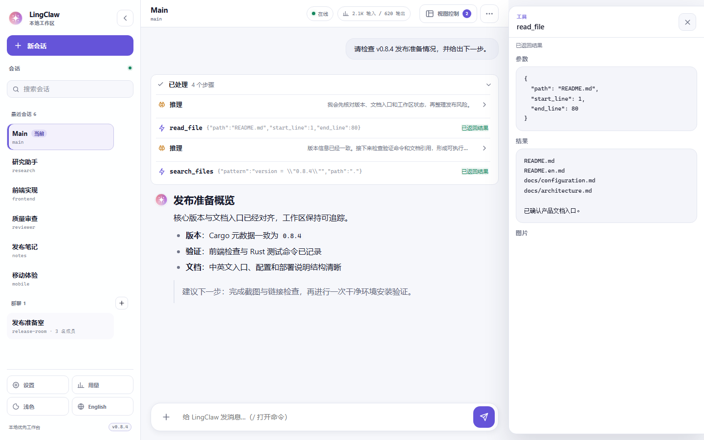
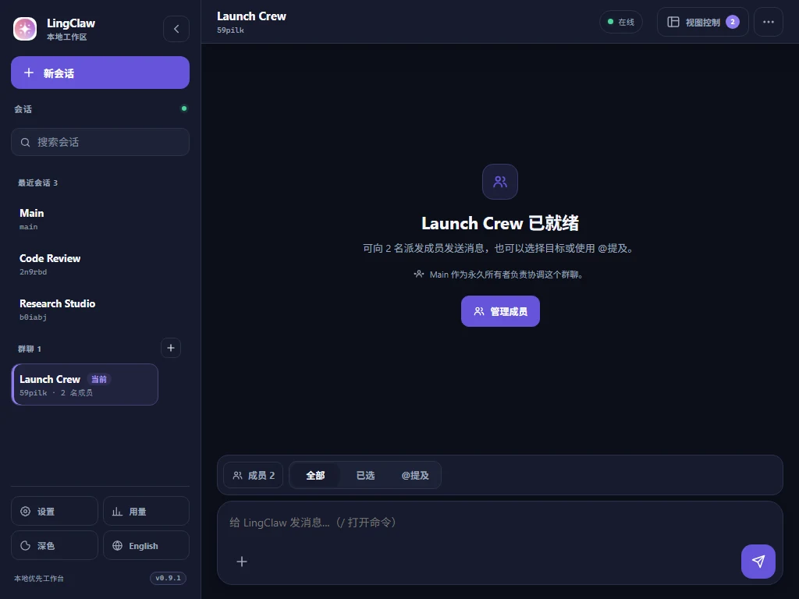
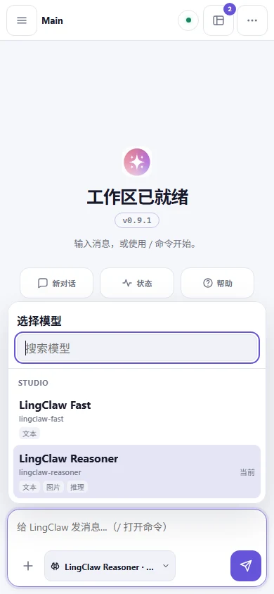
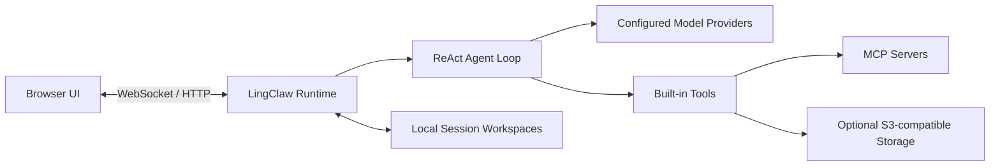

# LingClaw

<p align="center">
  
</p>

<p align="center">
  <strong>本地运行、Rust 构建的个人 AI Agent 工作台。</strong><br>
  连接你选择的模型、工具、Skills 与会话，把推理、执行和协作收进一个可控的工作循环。
</p>

<p align="center">
  <a href="README.md">简体中文</a> · <a href="README.en.md">English</a>
</p>

<p align="center">
  
  
  
</p>

<p align="center">
  
</p>

LingClaw 把个人 AI 助手需要的模型路由、工具执行、会话工作区、记忆、MCP 和多代理协作放进一个本地服务。浏览器负责交互，Rust Runtime 负责状态、边界和持久化；你决定接入哪个 Provider、开放哪些工具，以及每个 Agent 使用什么模型。

> LingClaw 面向本机单用户使用，默认只监听 `127.0.0.1`。它不是自带身份认证的公网多用户服务。

## 快速开始

### 准备

- Git，以及能够访问 Rust、Node.js 和模型 Provider 的网络环境。
- Windows 使用 PowerShell 5.1 或更高版本；Linux 使用 Bash。
- 安装脚本会检查 Rust 和 Node.js `>= 20.19.0`。如果无法准备 Node.js，会在仓库包含可用 `static/` 时使用预构建前端。

### Windows

```powershell
git clone https://github.com/Linkq123/LingClaw.git
cd LingClaw
powershell -ExecutionPolicy Bypass -File .\scripts\install-windows.ps1
```

### Linux

```bash
git clone https://github.com/Linkq123/LingClaw.git
cd LingClaw
bash scripts/install-linux.sh
```

安装脚本会构建 Rust 后端和最新前端，并部署内置 Skills 与 Sub-agents。快速开始时请选择 `Install`；如果希望以后直接输入 `lingclaw`，请同时接受 PATH 注册提示。

安装器运行在子进程中，当前终端不会继承它临时添加的 PATH。接受 PATH 注册后，可以重新打开终端并运行：

```bash
lingclaw
```

也可以不重开终端，直接从 Cargo 安装目录启动：

```powershell
$cargoHome = if ($env:CARGO_HOME) { $env:CARGO_HOME } else { Join-Path $HOME '.cargo' }
& (Join-Path $cargoHome 'bin\lingclaw.exe')
```

```bash
"${CARGO_HOME:-$HOME/.cargo}/bin/lingclaw"
```

首次启动会打开 Setup Wizard。普通对话开始前，需要完成两项显式配置：

1. 添加至少一个模型 Provider 和模型。
2. 为主 Agent 指定 `primary` 模型，或为当前 Session 使用 `/model` 选择已配置模型。

LingClaw 不会在缺少配置时静默调用内置默认模型。配置完成并启动服务后，访问 [http://127.0.0.1:18989](http://127.0.0.1:18989)。

输入区会区分不同的恢复路径：

- Provider 或 Model 尚未配置时，直接打开 Settings → Models。
- Agent `primary` 尚未配置时，直接打开 Settings → Agents。
- 当前 Session 的模型覆盖失效时，预填 `/model ` 让你重新选择。

这三种状态都会禁用普通发送，但仍允许状态、帮助和设置类命令，不会向未知模型发出请求。

常用服务命令：

```bash
lingclaw start
lingclaw stop
lingclaw restart
lingclaw status
lingclaw doctor
lingclaw update
```

安装细节、systemd、Docker 和反向代理说明见[部署指南](docs/deploy.md)。

## 你可以用 LingClaw 做什么

### 让 Agent 在受控循环中完成任务

LingClaw 使用 `Analyze → Act → Observe → Finish` 的 ReAct 状态机组织每轮工作。推理、工具调用、计划、Sub-agent 和 Orchestration 会聚合为可展开的执行栈；你可以查看过程、检查工具结果、在运行中追加指令或立即停止。

### 连接不同模型与协议

同一套 Session 和工具体系支持：

- OpenAI-compatible Chat Completions
- OpenAI Responses
- Anthropic Messages
- Gemini
- Ollama

模型按 `provider/model` 路由。Primary、Fast、Sub-agent、Memory、Reflection 和 Context 可以分别配置，Session 也可以保存自己的 `/model` 覆盖。

### 用 Session 隔离上下文，用 Group 组织协作

每个 Session 拥有独立工作区、提示文件、消息历史、Todos、记忆和能力配置。Group 可以把多个 Session 组织成群聊，支持广播、已选目标和 `@session-id` 精确提及；界面展示名称，协议始终使用稳定 ID。

### 在内置工具、MCP 与 Skills 之间扩展能力

LingClaw 提供文件、命令、搜索、网络、Todos 和条件化图片查看等标准工具。MCP client 可以连接 stdio 与 Streamable HTTP server，并按 Session 授权 tools、resources 和 prompts。Skills 则通过 `SKILL.md` 为 Agent 注入可发现、可覆盖的领域工作流。

### 把任务委托给 Sub-agents

`task` 用于单个委托，`orchestrate` 用于带依赖关系的 DAG 编排。内置代理覆盖探索、研究、前端、后端、通用实现和审查；每个 Sub-agent 在独立的受控 loop 中运行，并继承明确的模型与工具边界。

### 保存记忆并处理视觉输入

Session 可以维护人工可读的 `MEMORY.md`、每日日志、可选 Structured Memory 和 Daily Reflection。配置 S3-compatible 存储且模型声明图片输入能力后，用户附件、MCP 图片和 `view_image` 结果可以进入下一次模型请求；原始工具 Base64 不会写入日志、WebSocket 或会话 JSON。

## 产品界面

### 清晰的执行过程

Reasoning、Tool、Task Plan、Sub-agent 和 Orchestration 统一进入单个执行栈。完成后保留紧凑摘要，展开时可查看每一步；工具参数、结果和图片进入独立 Inspector，不挤压主对话。

### 面向协作的群聊

<p align="center">
  
</p>

Group 上下文栏提供“全部 / 已选 / @提及”三种派发模式。Main 是永久 Owner，成员模型缺失、运行状态、管理操作和提及对象都会在界面中明确呈现。

### 完整的移动端体验

<p align="center">
  
</p>

会话导航在手机上使用全屏抽屉，工具详情改为底部面板，输入区适配安全区域与多行内容。关键触控目标不小于 44px，并保留键盘、焦点返回和减少动效支持。

### 集中的 Settings 与 Usage

Settings 使用同一份运行时配置快照管理 Providers、Models、Agent 路由、Skills、MCP 与 S3；保存前完成校验，并对并发编辑提供冲突提示。Usage 将今日与累计 Token、Agent role、Provider 和每日趋势放在同一个仪表盘中，空数据与部分数据都有明确状态。

## 工作原理



- **Browser UI**：响应式工作台，负责会话导航、流式消息、执行栈、Settings 和 Usage。
- **Runtime**：单个 Rust 进程，管理 WebSocket、配置快照、并发 Session、Group 派发和持久化。
- **Agent Loop**：在明确的阶段与上限内选择模型、调用工具、吸收观察并完成回复。
- **Workspace**：默认位于 `~/.lingclaw/<session-id>/workspace/`，包含提示、Skills、Agents 和记忆。

更完整的模块、Provider 转换和持久化说明见[架构文档](docs/architecture.md)。

## 数据与安全边界

| 数据 | 默认位置或去向 | 何时离开本机 |
|---|---|---|
| 配置与凭据 | `~/.lingclaw/` | 不会整份自动同步；连接 Provider、MCP 或 S3 时，相应凭据会发送给该服务用于鉴权 |
| Session、Group、Todos 与记忆存档 | `~/.lingclaw/` | 存档不自动同步；相关内容进入模型上下文时会发送给你选择的 Provider |
| 提示、对话和工具观察 | 当前 Session 与 Runtime | 作为模型请求内容发送给你选择的 Provider |
| 用户附件与工具图片 | 可选 S3-compatible 存储 | 仅在启用 S3 和图片能力后上传 |
| MCP 数据 | 对应 MCP server | 由你启用的 server 与 tool 决定 |

- Web 服务默认绑定 `127.0.0.1`，不会直接监听局域网或公网地址。
- 配置、Session、Group、Todos 和记忆存档保存在本机 `~/.lingclaw/`，LingClaw 不会自动同步整份存档。
- 模型请求可能包含系统提示、对话历史、工具观察，以及被注入上下文的 Todos 和记忆内容；这些内容会发送给你配置的模型 Provider，请以对应 Provider 的数据政策为准。
- 本地图片上传与工具图片闭环依赖可选 S3-compatible 存储。OpenAI/Anthropic 需要可被远端访问的签名 URL；Gemini/Ollama 由 LingClaw 本地预取图片。
- 文件工具限制在当前 Session 工作区；网络工具执行 SSRF 检查并禁止重定向；命令工具包含危险命令检测与超时。
- MCP tool 是否可用由当前 Session policy 决定；可变更外部状态的 MCP tool 可以要求确认。

LingClaw 能执行命令并修改工作区文件。请像使用其他本地开发 Agent 一样，审查工具权限并保护 `.lingclaw.json` 中的凭据。

## 文档

| 文档 | 内容 |
|---|---|
| [用户指南](docs/user-guide.md) | Session、Group、命令、工具、Skills、Sub-agents、记忆与图片 |
| [配置指南](docs/configuration.md) | Providers、模型、Agent 路由、MCP、S3 和环境变量 |
| [部署指南](docs/deploy.md) | Windows、Linux、systemd、Docker 与反向代理 |
| [架构文档](docs/architecture.md) | ReAct loop、模块职责、Provider、安全和持久化 |
| [后端接口](docs/backend-api.md) | HTTP API、WebSocket 事件与错误语义 |
| [系统 Skills](docs/system-skills.zh-CN.md) | 随 LingClaw 分发的 Skills 清单 |

规范的新式 JSON 配置示例见 [`.lingclaw.json.example`](.lingclaw.json.example)。

## 开发

### 后端

```bash
cargo fmt --check
cargo clippy --all-targets --all-features
cargo test
cargo build
```

### 前端

```bash
cd frontend
npm ci
npm run typecheck
npm test
npm run lint
npm run fmt:check
npm run build
```

前端源码位于 `frontend/`，Vite 构建产物写入 `static/`。仅执行 `cargo install --path .` 不会自动把这些静态资源和内置 Skills/Sub-agents 部署到二进制旁边，日常安装优先使用仓库脚本或 `lingclaw install`。

欢迎通过 Issues 和 Pull Requests 报告问题、补充文档或改进实现。

### 仓库结构

```text
LingClaw/
├── src/                    # Rust Runtime、Providers、Tools 与 CLI
├── frontend/               # TypeScript 工作台与 React Settings/Usage
├── static/                 # Vite 构建产物
├── docs/
│   ├── reference/          # Prompt templates、系统 Skills 与 Sub-agents
│   └── assets/readme/      # 隔离演示数据生成的产品截图
├── scripts/                # Windows 与 Linux 安装脚本
├── .lingclaw.json.example  # 完整配置示例
└── Cargo.toml
```

## 鸣谢

LingClaw 的设计受到 OpenClaw、Claude Code、DeerFlow、OpenCode、Agent Skills 规范以及开源 AI 工具生态的启发。感谢所有参与测试、审查和完善项目的人。

## License

LingClaw 使用 [MIT License](LICENSE)。
