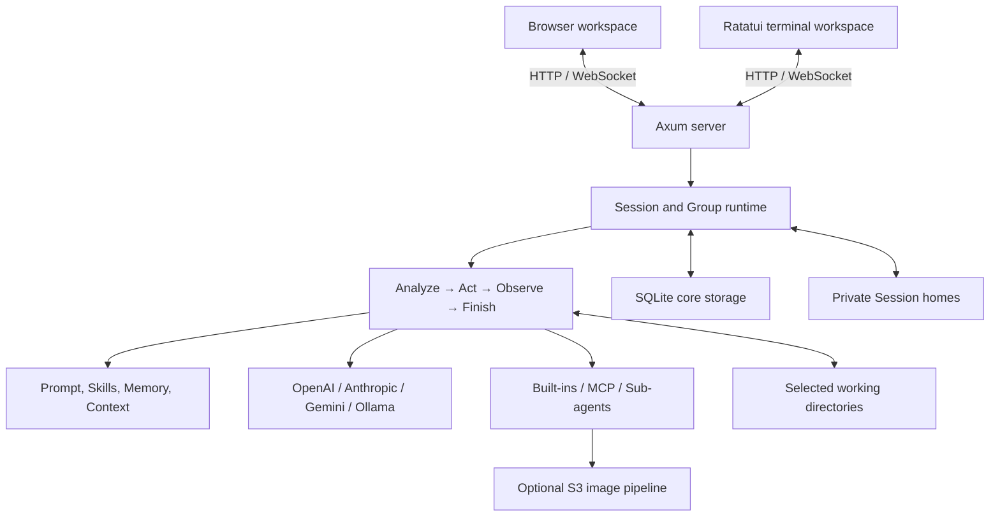
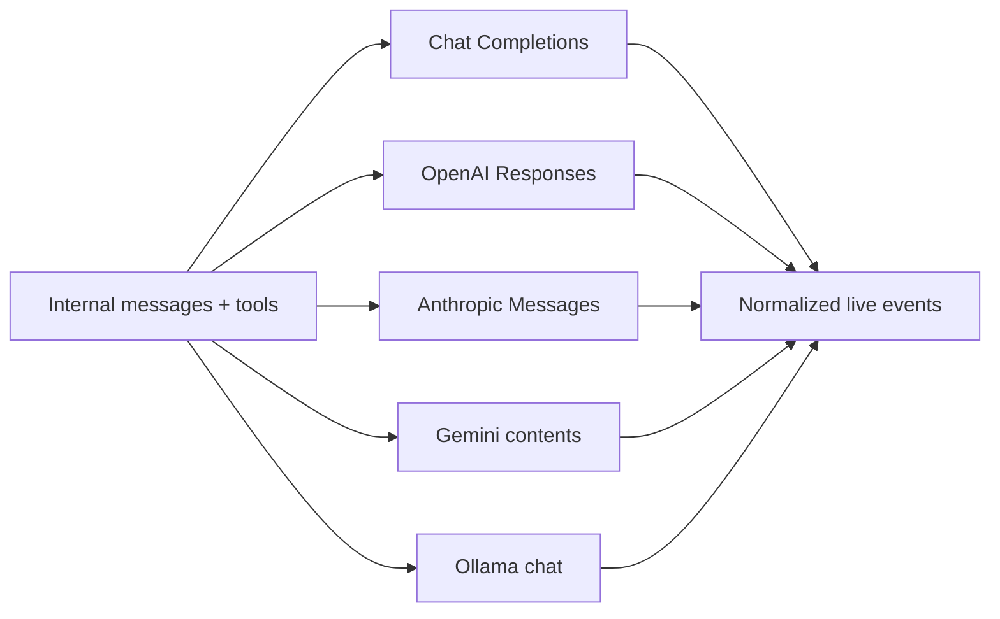
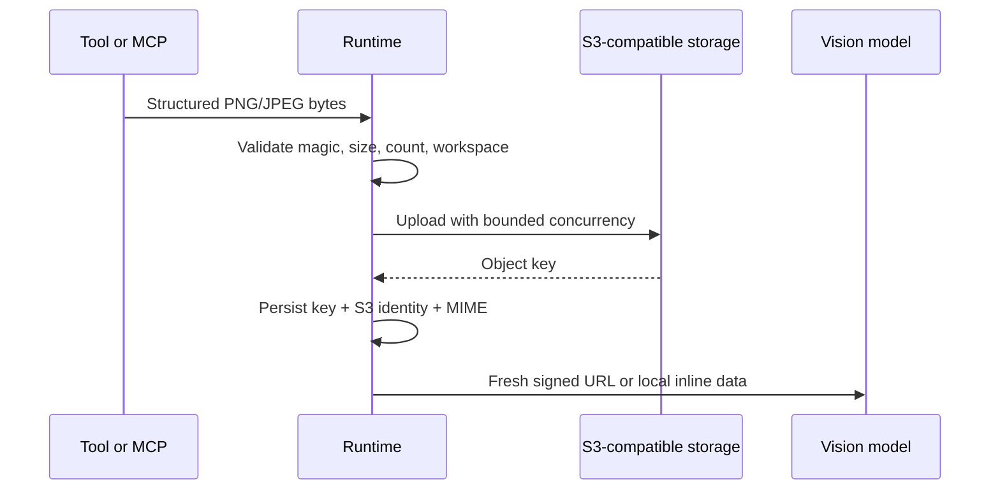

# LingClaw Architecture

[简体中文](architecture.md) · [English](architecture.en.md) · [Back to README](../README.en.md)

LingClaw is a single-process Rust runtime with a static browser frontend and a Ratatui terminal client. Both surfaces share the HTTP/WebSocket protocol. Its design does not hide agent execution; it runs execution inside an inspectable state machine, explicit tool boundaries, and a persistent data model.

## System overview



Three responsibility layers:

- **Skill** — Prompt construction, model routing, context pruning, reasoning controls, skills, and memory injection.
- **CLI / TUI / Tools** — Daemon management, the asynchronous terminal client, files, shell, networking, todos, MCP, images, and safety checks.
- **Loop** — WebSocket session runtime, ReAct, slash commands, persistence, live replay, and background work.

## ReAct runtime

`src/runtime_loop.rs` drives an explicit state machine:

| Phase | Runtime behavior |
|---|---|
| Analyze | Freeze the run configuration and model snapshot, build prompts and budgets, ask the model to answer or call tools |
| Act | Validate arguments and policy, then execute sequential/parallel tools, MCP, sub-agents, or orchestration |
| Observe | Store complete tool results and derive non-destructive summaries, WorkingState, and optional Task Plan guidance |
| Finish | Complete streaming output, persist the session, and enqueue optional Memory/Reflection work |

Each run maintains an ephemeral `WorkingState` containing intent, goal, evidence, completed steps, blockers, and next actions. It helps the loop decide whether to continue but never replaces original messages or tool output.

### Run boundaries

- An agent run uses the immutable `Config` and effective session-model snapshot acquired at its start boundary. Hot configuration updates cannot move an active run onto another model.
- HTTP-level retries handle only transient connection, timeout, 429, and 5xx failures. Agent cycles are a higher decision layer.
- `/stop` and service shutdown cancel the active run and propagate into in-flight tools and sub-agents; hard caps and timeouts terminate work at their respective boundaries. A browser disconnect only detaches the connection and does not stop a retained active run.
- Normal user text received while busy becomes a delayed intervention before the next Analyze phase rather than interrupting a tool transaction.
- Plan Mode uses a separate `PlanOnly` boundary with explicitly read-only capabilities, while groups reject `plan_only` at the protocol boundary. Approval starts a normal run by persistent `plan_id + revision` without writing a synthetic user message.

### Plan Mode lifecycle

`src/plan.rs` owns structured artifacts, validation, evidence fingerprints, immutable completion contracts, and progress updates. A Plan-only loop can terminate only through internal `submit_plan`: `needs_input` requires blocking questions, while `ready` requires stable step IDs and binds every verification/acceptance item to a server-verifiable `completion_checks` entry. `plan_progress` may be an additional gate, but Agent-reported step state never supplies contract-clause coverage by itself. Models without Tool Calling fall back to a single legacy step that retains the original Markdown.

SQLite v5 separates lifecycle state into `session_plans`, immutable `session_plan_revisions`, and `session_plan_progress`, keeps feedback that has not yet produced a new revision on the active plan, and persists both the initial-submission marker and the stale-evidence override confirmation time. A session may have only one active plan, revisions use optimistic concurrency, and History restores at most the latest 50 read-only revisions while always retaining the current revision. Local files/directories and constrained `git_inspect` calls contribute up to 256 evidence records: filesystem entries store workspace-relative SHA-256 fingerprints, while Git inspections store their constrained selector and result fingerprint. The runtime rechecks them before approval. A stale override token binds both the plan revision and the actual evidence snapshot observed during that check, preventing another change between the warning and execution from being silently accepted. The explicit override decision remains durable even when evidence capture was incomplete but produced no changed path; MCP and HTTP observations are not included in the re-verifiable set.

Every execution cycle receives the complete `ApprovedPlanContext`. Internal `update_plan` may update step status or append a step with a required deviation reason; it cannot remove original steps or change the approved goal and acceptance criteria. A stale override admits only the observed evidence snapshot and never refreshes the revision. At Finish, the runtime rechecks final workspace paths, approved evidence, or exact successful tool calls under the bound `plan_id + revision`; `plan_progress` may add a progress gate but does not count as server-verifiable coverage, and terminal step progress is only necessary. Every workspace filesystem tool, child-process cwd, initial Plan evidence capture, and Finish check first establishes a no-follow persisted-root capability. Component opens, creation, deletion, enumeration, and evidence reads remain capability-bound through the actual operation; a checked capability is never downgraded to an unguarded pathname, and the root is never recanonicalized into a replacement target. Linux and Android builds use `openat2` with `RESOLVE_BENEATH | RESOLVE_NO_SYMLINKS | RESOLVE_NO_MAGICLINKS | RESOLVE_NO_XDEV`; each actual operation reacquires root, namespace, and target identity anchors and revalidates them at every I/O, truncate, create, unlink, or spawn boundary, failing closed when the syscall or ABI is unavailable. Windows resolve probes open the final entry with zero data access through root-relative `NtCreateFile` from the locked parent, preserving identity while keeping delete-sharing and write-only ACL compatibility. Actual operations also open the final object relative to that locked parent chain and compare the original identity with a nonzero volume serial plus the complete 128-bit `FILE_ID_INFO`, reject both all-zero and all-FF non-unique sentinels, and fail closed when the query is unsupported; they normally deny delete sharing for the side-effect lifetime, while the compatibility fallback for an already-open DELETE-access handle still revalidates the original identity at every operation boundary. APIs that accept only a cwd or enumeration pathname run while the full component-chain guard is alive. Cached stdio MCP sessions retain the workspace/cwd capability: only the target Linux/Android MCP child inherits a stable directory fd exposed as `/proc/self/fd/<n>` while the parent copy remains close-on-exec; Windows keeps a no-delete handle chain alive while the ordinary root URI is used. Streamable HTTP cannot transfer a local OS capability to a remote server, so it does not advertise `roots` and rejects `roots/list` with `-32601`; its local workspace capability is still revalidated on every reuse and request. Each full Session cache key uses one stable per-key request control: Settings or server invalidation advances its epoch without replacing locks with in-flight leases, and every ordinary response must match the original `session_id + generation`. All Streamable HTTP initialize and DELETE side effects—ordinary cached Sessions, temporary one-shot Sessions, stale responses, and SSE/workspace/idle/Settings/server cleanup—also share a normalized remote cleanup-domain authority per configured endpoint. Normalization strips URL userinfo and fragments, decodes only percent-encoded RFC-unreserved octets, normalizes retained percent escapes to uppercase hex, and preserves reserved encodings while retaining scheme, host, effective port, path, and query; invalid percent escapes fail closed. Transport POST/GET SSE/DELETE clients use that same canonical endpoint and reject redirects, while OAuth discovery/token clients retain their independent redirect policy. Timeout, stdio-only command/args/env/cwd, workspace, policy namespace, client capabilities, local server aliases, configured headers, rotating credentials, and other local cache dimensions never partition the domain because MCP does not prove they isolate DELETE side effects or Session IDs. An initialize attempt arms an RAII owner immediately before the request may be sent; cancellation, panic, timeout, runtime invalidation, or an unknown response leaves a process-lifetime domain tombstone. A temporary Session carries that owner across initialize handoff and keeps it armed through requests and shutdown, so Drop or cancellation before terminal cleanup synchronously quarantines the endpoint and removes local Session/event/stream state. A known Session ID from a failed response or `notifications/initialized` is deleted under the same domain, and only a confirmed or definitively unperformed DELETE releases it. Cleanup records a pending tombstone and detaches the old local generation before sending DELETE. Cancelling the caller leaves the pending/uncertain quarantine in place and cannot cancel the runtime-owned request. Only `200 OK` or `204 No Content` proves that DELETE completed. MCP-specific `404` (Session already absent), `405` (client termination unsupported), and `410` (target gone) prove that no delayed DELETE remains. `202 Accepted`, every other status, timeout, transport failure, or cleanup-task cancellation retains an uncertain tombstone and blocks initialize for the same endpoint for the lifetime of the process while unrelated endpoints remain independent. Endpoint authority tracks active identities across all cache keys. Installing the same Session ID for a new key atomically invalidates and removes the old key's generation, event ID, SSE task, and descriptor caches and records a supersession gate, so old requests fail before send; cleanup also skips remote DELETE while that replacement is current. Idle expiry holds both endpoint and cache-key authority across controlled DELETE and replacement initialize, concurrent callers share one flow, and any ambiguous cleanup blocks reinitialization. Thus a late response or old cleanup cannot revive, overwrite, reuse without cleanup, or remotely terminate a replacement. Confirmed or definitively unperformed cleanup reclaims otherwise empty per-key controls, endpoint controls, and mappings after their final lease. Released platforms are Windows and Linux; other Unix targets explicitly fail closed for secure workspace operations because `st_dev` alone cannot prove mount identity. File metadata, exact bytes, and SHA-256 come from the same checked handle with a hard actual-byte limit. Verification is bounded by the shorter of `toolTimeout` and a 30-second hard deadline, and cooperatively checks `/stop`, run cancellation, and daemon shutdown between checks, directory entries, and file chunks. Cancellation writes neither Completed/Failed nor a contract error; deadline expiry fails closed through a stable timeout check. A missing, failed, or contradictory check blocks its original step and leaves the plan failed but revisable/resumable, so an adaptive step cannot replace the approved contract. `enableTaskPlan` remains compatibility guidance only for ordinary Execute runs without an approved plan.

Both `planning` and `executing` depend on an in-memory Agent run reservation. Before loading sessions at process startup, the storage layer transactionally recovers either leftover state as `stopped`. Resume is available only when the plan retains an approval timestamp and a positive execution-attempt count; an interrupted planning run can only be revised or discarded. The model-facing `feedback` prompt is retained with the active plan, while a `refresh` prompt lives only in its Plan-only run; neither is persisted as a user transcript message.

### Execution Stack

The backend keeps granular live events. The frontend aggregates Reasoning, Tool, Task Plan, Sub-agent, and Orchestration under one top-level run. Steps across several ReAct cycles remain in the same stack. Tool results update the original step by tool-call ID instead of creating duplicate cards.

When historical data has no reliable start time, the frontend omits duration. A stack with no steps after type filtering is hidden and its related inspector/modal is closed.

## Backend module ownership

| Module | Primary responsibility |
|---|---|
| `main.rs` | Axum routing, HTTP/WS security, shared state, config transactions, live replay |
| `tui.rs` | Ratatui client, daemon discovery, directory-session selection, terminal events, and responsive layout |
| `runtime_loop.rs` | Top-level Analyze/Act/Observe/Finish loop |
| `agent.rs` | Phases, TaskIntent, WorkingState, Task Plan, finish decisions |
| `providers.rs` | Provider conversion, requests, stream parsing, and usage |
| `config.rs` | JSON/environment loading, validation, model resolution, explicit model state |
| `commands.rs` | Slash commands |
| `context.rs` | Token estimates, request budgets, pruning |
| `hooks.rs` | LLM/Tool/Command lifecycle and automatic context compression |
| `prompts.rs` | Workspace prompts, Bootstrap, skill discovery and injection |
| `plan.rs` | Plan artifacts, revisions, evidence fingerprints, progress, and internal tool schemas |
| `storage/` | SQLite schema, session/group repositories, legacy JSON migration, status inspection, and online backup |
| `session_store.rs` | Session runtime adapter, normalization, and workspace compatibility logic |
| `session_group.rs` | Group model, members, admins, voting, and replay payloads |
| `session_control.rs` | Main-only cross-session/group control plane and dispatch |
| `todos.rs` | Todo validation, revision conflicts, and broadcast |
| `memory.rs` | Structured Memory, Daily Reflection, and queues |
| `image_uploads.rs` | PNG/JPEG validation, S3 upload, signing, configuration identity |
| `tools/` | ToolSpec, dispatch, file/shell/network/MCP/view_image, and constrained read-only `git_inspect` |
| `subagents/` | Discovery, isolated execution, and DAG orchestration |

`src/main.rs` owns protocol boundaries rather than every business rule. Module tests live under `src/tests/` and are included by the corresponding source module.

## Provider adapters

The runtime uses common `ChatMessage`, tool call, and `ToolOutcome` values. `providers.rs` converts them to each upstream protocol:



- OpenAI Chat consumes SSE deltas and `tool_calls`.
- OpenAI Responses uses `stream: true` and maps output text, reasoning summary, and function-call events into the internal stream.
- Anthropic merges consecutive tool results into user content blocks and supports prompt caching and thinking budgets.
- Gemini preserves `functionCall.id`, `functionResponse.id`, and real `thoughtSignature`; images use `inlineData`.
- Ollama consumes an NDJSON stream and sends `think` and images according to model capability.

The common think level plus optional `compat.thinkingFormat` maps reasoning effort. Memory, Reflection, and Context helpers enter the same usage accounting but do not consume tool images again.

## Tool system

`ToolSpec` describes name, instructions, JSON schema, and execution properties. Each call passes through:

1. Availability for the current run mode and session policy.
2. Object/required/type/range/length validation.
3. Hook permission.
4. Tool-specific sandbox, timeout, and size limits.
5. Structured `ToolOutcome` with output, error, duration, and in-memory images.

Read-only parallel tools share batch ordering and an image budget. A failed result does not erase other completed results, and the model receives observations in original tool-call order.

### MCP

The MCP client supports stdio and Streamable HTTP:

- initialize and paginated tools/resources/prompts catalogs
- ping, optional stdio roots, and list-changed notifications; Streamable HTTP does not advertise local roots
- Streamable HTTP POST/GET SSE
- OAuth PKCE, refresh tokens, and a local token store
- startup failure cooldown, idle session cleanup, and timeout cancellation
- Per-session server/tool policy and mutating-tool confirmation

An ordinary Session-bound POST holds a `cache key + epoch + generation` RAII in-flight count from final pre-send validation through response, error, or cancellation. Idle cleanup revives or defers that exact generation while its count is nonzero, and an old request's Drop cannot decrement a replacement generation. Once a response reaches a terminal workspace/identity/404 failure, cleanup releases only that completed response's own lease, atomically installs endpoint and cache-key Pending quarantine, detaches the old local generation, and gives a runtime-owned task responsibility for waiting until every other request on that exact generation ends. The last normally completed lease wakes exactly one DELETE. Request cancellation or cleanup-task cancellation forces both cleanup layers to Uncertain even if a late DELETE reports success. Transport, response-body, and SSE timeouts synchronously quarantine the endpoint and remove the exact local generation before any best-effort `notifications/cancelled` token lookup or network await because the remote POST may still complete; this applies to ordinary cached requests, temporary one-shot requests, and one-shot initialize attempts before a Session ID exists. If endpoint cleanup is already Pending, a timeout atomically and monotonically promotes that same tombstone to sticky Uncertain; an older DELETE observer, later lifecycle cleanup, notification success/failure/timeout, or caller cancellation cannot downgrade or remove it. Before DELETE, the old task also refuses to target a same-endpoint, same-Session-ID replacement, while unrelated endpoints remain independent. As soon as an initialize response installs a Session ID, the owner binds that exact generation; cancellation before `notifications/initialized` or SSE handoff completes quarantines the endpoint and removes only that generation's Session, event ID, stream, and descriptor state in the same runtime transaction. The Active fast path also checks Pending/Uncertain endpoint cleanup first.

Streamable HTTP tools/resources/prompts/catalog cache entries carry the per-key control epoch, Session generation, and list-change epoch. Cache hits and writes both revalidate that authority under the HTTP runtime state. After same-ID replacement, Settings/server invalidation, or a `list_changed` notification advances it, an old response that has returned but not yet cached fails its CAS and cannot repopulate stale descriptors. Stdio caches retain their existing local-Session semantics.

Exposed MCP names contain a stable server/tool identity to avoid collisions. Resources and prompts are browsed and inserted manually rather than becoming tools automatically.

### Sub-agents

The sub-agent executor creates isolated messages, a filtered tool set, and a mini-ReAct loop. The parent receives progress and a final text result only. `task`, `orchestrate`, and shared `todos` are excluded to prevent recursion and shared-state races.

The orchestrator validates a DAG, runs topological layers concurrently, propagates dependency results, and emits task events. A failed dependency fails or skips downstream tasks while independent work may continue.

## Sessions, groups, and persistence

```text
~/.lingclaw/
├── .lingclaw.json
├── mcp-auth.json
├── lingclaw.db
├── backups/
├── system-skills/
├── system-agents/
├── skills/
├── agents/
└── <session-id>/workspace/
    ├── BOOTSTRAP.md
    ├── AGENTS.md
    ├── IDENTITY.md
    ├── SOUL.md
    ├── USER.md
    ├── MEMORY.md
    ├── structured_memory.json
    ├── memory/
    ├── skills/
    └── agents/
```

`lingclaw.db` is the only persistent source for sessions, messages, todos, usage, sub-agent snapshots, group data, and working-directory bindings. Schema v6 stores `workspace_kind`, canonical `working_directory`, and its platform comparison key in `sessions`, with an indexed lookup. Complex provider fields use JSON columns, while identity, order, time, and tool IDs remain queryable columns. Message saves fingerprint the common prefix and rewrite only the changed tail; multi-table session/group updates commit in one transaction. SQLite runs with WAL, `foreign_keys=ON`, `synchronous=NORMAL`, and a five-second busy timeout, with ownership and schema tracked through `application_id`, `schema_migrations`, and `user_version`.

On the first launch that finds old `sessions/` or `groups/`, the runtime migrates before serving HTTP requests. It applies primary/`.tmp` recovery, validates IDs, references, and hashes, atomically moves the directories to `backups/sqlite-migration-<timestamp>/`, then imports, verifies, and records completion in one SQLite transaction. A two-phase journal resumes interrupted migrations. Successful migration never reads or writes the JSON store again, and the backup is never deleted automatically. Schema upgrades create a consistent database backup first.

A runtime SQLite I/O, corruption, or constraint error places the process in sticky `protected` mode. Active agent/group runs are cancelled and core database writes are rejected, while reads and independent `.lingclaw.json` saves remain available. HTTP returns stable `503 storage_protected` responses and WebSockets broadcast `storage_status`; restart after fixing the external problem.

Every session has two explicit boundaries. `session_home` stays at `~/.lingclaw/<id>/workspace/` for persona, memory, skills, agents, MCP policy, and caches. `working_directory` is the project root for file, shell, Git, image, Plan-evidence, and MCP-root operations. An external project contributes only a read-only root `AGENTS.md`/`AGENT.md` and cannot override LingClaw tool-safety policy. Session deletion commits its database transaction—including group membership and vote cleanup—then removes only the private Session Home; it never removes an external project.

### Bootstrap prompt

- While `BOOTSTRAP.md` exists, load Bootstrap + AGENTS.
- After the user meaningfully fills IDENTITY/USER, remove Bootstrap and enter Normal mode.
- Normal mode loads AGENTS, IDENTITY, USER, SOUL, MEMORY, and today/yesterday memory.
- Template updates affect new sessions only and never overwrite an existing workspace.
- YAML frontmatter remains template metadata and is removed before prompt injection.

### Group invariants

- `settings.enableGroups` defaults to `false`. Protocol and model tools fail closed when disabled, stored Group data remains untouched, and hot-disable stops active Group runs before closing Group sockets.
- Main is the implicit permanent owner and never a regular dispatch member.
- Promoted admins live in `admins[]`. Admin member removal uses a two-thirds threshold over promoted admins; owner removal is direct.
- Only `@session-id` participates in protocol routing. Display names are never parsed as targets.
- A group cannot be deleted while a member run is queued/running; stop it first.
- Failed or stopped member runs do not create normal session reply bubbles or trigger mention follow-up.

## Live connection and ordering

The browser normally connects through `/ws?session=<id>` or `/ws?group=<id>&session=main`. Initialization generally replays session/group metadata, view/model state, todos, and history in that order.

When a page reloads during an active run, a new connection may attach to `live_round` and receive later events plus the terminal state without re-running completed work. Model-configuration events carry `configRevision`; the frontend rejects stale revisions within one backend process so Settings saves, session `/model`, and reconnect payloads cannot apply out of order.

Todos use a separate `todos_state` and `/api/todos` revision. Configuration saves use an independent `configFileEtag` for optimistic concurrency. It is a different ordering domain from model `configRevision`.

See the [backend API reference](backend-api.md) for complete requests and events. It is currently maintained in Chinese.

## Image data flow



The runtime never guesses images from arbitrary text, stdout, paths, or URLs. Raw Base64 does not enter logs, WebSocket payloads, model text, or SQLite. A tool batch retains at most 10 images, upload concurrency is limited to three, and result order follows tool-call order.

Signing depends on the S3 configuration identity. After identity changes, an old key is skipped instead of being re-signed under the new configuration. Image failure adds an unavailable notice without changing the original tool success state.

## Frontend architecture

The frontend uses Vite and TypeScript. Most of the workspace renders through direct DOM operations; Settings and Usage are lazy React islands. Vite writes to `static/`, which Rust serves directly.

Primary ownership:

- `main.ts` — Entry point and live-event switchboard
- `socket.ts` — Connection, reconnect, and session/group binding
- `input.ts` — Composer, slash, mention, images, send/stop
- `state.ts` — Central UI state and typed DOM refs
- `renderers/execution-stack.ts` — Top-level process aggregation
- `renderers/tools.ts` — Inspector and image gallery
- `actionDialog.ts` — Session/group mutation dialogs
- `composerAvailability.ts` — Explicit model-configuration gate
- `pages/SettingsPage.tsx` / `UsagePage.tsx` — React pages

Markdown passes through marked, DOMPurify, highlight.js, and KaTeX. Repeated decoration must be idempotent: code toolbars, mention highlights, and image galleries cannot duplicate during streaming re-renders.

## Security boundaries

| Boundary | Constraint |
|---|---|
| Web | Loopback-only bind; shutdown uses a local token |
| Files | `resolve_path_checked` prevents workspace escape and handles symlinks |
| Shell | Dangerous-command rules, configurable timeout, output limit |
| Network | HTTP/HTTPS only, reject private targets after DNS, no redirects |
| MCP | Session policy, workspace cwd, local OAuth storage, mutating confirmation |
| Images | PNG/JPEG magic, 10MB, 10 per batch, S3 identity |
| Config | Schema validation, atomic save, ETag, runtime snapshots |

These boundaries reduce accidental and cross-scope access but are not virtual-machine isolation. Once an agent receives `exec` or a write tool, it can change data inside the granted workspace. Deploy with the minimum permissions appropriate for the model and task.
