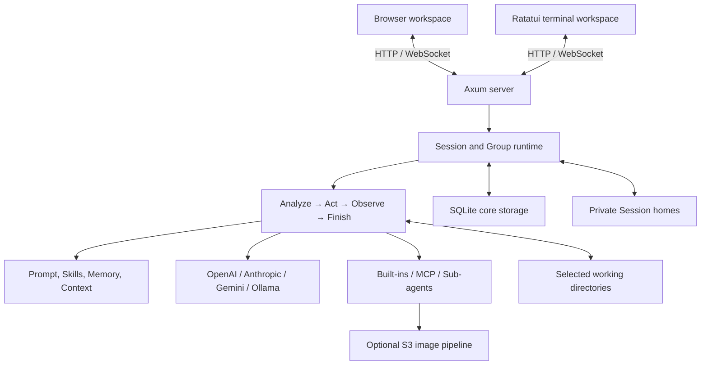
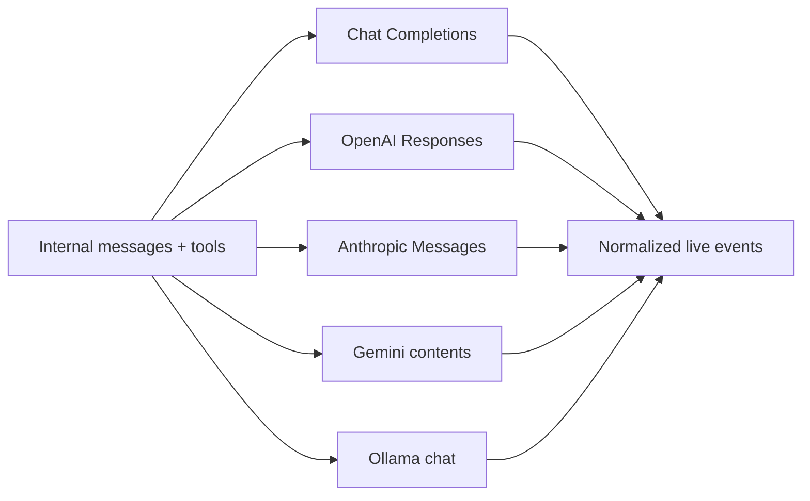
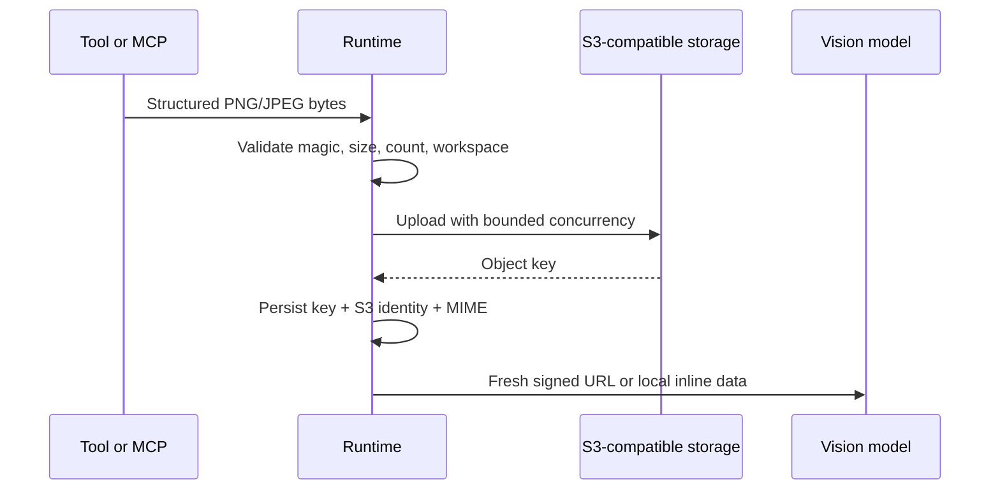

# LingClaw 架构

[简体中文](architecture.md) · [English](architecture.en.md) · [返回 README](../README.md)

LingClaw 是单进程 Rust Runtime，提供静态浏览器前端与 Ratatui 终端客户端。两种界面共享 HTTP/WebSocket 协议；设计目标不是隐藏 Agent 的执行过程，而是在可检查的状态机、工具边界和持久化模型中运行它。

## 总体结构



三个职责层：

- **Skill**：提示构建、模型路由、上下文裁剪、思考控制、Skills 和记忆注入。
- **CLI / TUI / Tools**：daemon 管理、异步终端客户端、文件、shell、网络、Todos、MCP、图片和安全检查。
- **Loop**：WebSocket Session runtime、ReAct、Slash Commands、持久化、live replay 和后台任务。

## ReAct Runtime

`src/runtime_loop.rs` 驱动显式状态机：

| 阶段 | Runtime 行为 |
|---|---|
| Analyze | 固定本轮配置与模型快照，构建提示和请求预算，让模型回答或产生 tool calls |
| Act | 校验参数和权限，执行顺序/并行工具、MCP、Sub-agent 或 Orchestration |
| Observe | 把完整 tool result 写入消息，并生成非破坏性摘要、WorkingState 和可选 Task Plan |
| Finish | 完成流式回复、持久化 Session、触发可选 Memory/Reflection 后台工作 |

每轮维护临时 `WorkingState`，记录意图、目标、证据、已完成步骤、阻塞和下一步。它用于帮助循环决定继续还是结束，不替代原始消息和工具结果。

### 运行边界

- Agent run 使用启动边界取得的不可变 `Config` 和有效 Session model 快照，配置热更新不会让进行中的 run 落入另一模型。
- HTTP 级 LLM 重试只处理瞬态连接、超时、429 和 5xx；Agent cycle 是更高一层的决策循环。
- `/stop` 和服务关闭会取消当前 run，并向正在执行的工具和 Sub-agent 传播；各层 hard cap 与超时在各自边界终止工作。浏览器断开只解除连接，不会停止仍在运行的 active run。
- Busy 时收到的普通用户文本作为 delayed intervention 排队，在下一次 Analyze 前注入，不强行截断当前 tool transaction。
- Plan Mode 使用独立 `PlanOnly` 边界，只暴露显式只读能力；Group 在协议边界拒绝 `plan_only`。批准后用持久化 `plan_id + revision` 开始正常 run，批准动作不写入虚假 user message。

### Plan Mode 生命周期

`src/plan.rs` 是结构化计划、校验、证据指纹、不可变完成合同和进度更新的领域边界。Plan-only loop 只能通过内部 `submit_plan` 终结：`needs_input` 必须包含阻塞问题；`ready` 必须包含稳定步骤 ID，并把每条 verification/acceptance criterion 绑定到服务端可验证的 `completion_checks`。`plan_progress` 只能作为附加门禁，Agent 自报的步骤状态不能单独提供合同条款覆盖。模型不支持 Tool Calling 时退化为一个保留原始 Markdown 的 legacy 步骤。

SQLite v5 把生命周期拆为 `session_plans`、不可变 `session_plan_revisions` 和 `session_plan_progress`，并在活动计划上暂存尚未形成新 revision 的反馈，同时持久化初次提交标记和过期证据覆盖确认时间。同一 Session 只允许一个活动计划；revision 使用乐观并发，History 最多恢复最近 50 个只读 revision，并始终包含当前 revision。规划时通过本地工具读取的文件/目录以及受限 `git_inspect` 查询最多记录 256 项证据：文件系统项保存相对路径与 SHA-256，Git 查询保存受限参数与结果指纹，并在批准前重新验证。过期覆盖令牌同时绑定 plan revision 与本次验证得到的实际证据快照，避免警告与执行之间的再次变化被静默放行；即使证据采集不完整但没有具体变化路径，用户的明确覆盖决定也会持久化。MCP/HTTP 观察不参与此可验证证据集合。

执行阶段的每个 cycle 都注入完整 `ApprovedPlanContext`。内部 `update_plan` 只能更新步骤状态，或在提供偏离原因时追加步骤；不能删除原步骤，也不能修改已批准的目标与验收标准。过期覆盖只放行当前证据快照，不会刷新 revision。Finish 会按 `plan_id + revision` 重新验证最终工作区路径、批准时证据或精确成功工具调用；`plan_progress` 仍可增加一步进度门禁，但不算服务器验收覆盖，所有步骤完成也只是必要条件。所有工作区文件工具、子进程 cwd、Plan 初始证据与 Finish 检查都会先建立 no-follow 的持久化根 capability，并让逐组件打开、创建、删除、枚举和证据读取在实际操作结束前始终受该 capability 约束；不会把“已安全验证”降级成无 guard 的裸 pathname，也不会重新 canonicalize 根后接受替换目标。Linux 与 Android 构建使用带 `RESOLVE_BENEATH | RESOLVE_NO_SYMLINKS | RESOLVE_NO_MAGICLINKS | RESOLVE_NO_XDEV` 的 `openat2`，在每次实际操作重新取得根、命名空间与目标身份锚，并在每次 I/O、truncate、create、unlink 或 spawn 边界再次复核；syscall/ABI 不可用时稳定 fail-closed。Windows 的 resolve 探测从已锁定父目录用 root-relative `NtCreateFile` 以零数据权限保留最终 identity，并保持 delete-sharing/只写 ACL 兼容；实际操作也从同一锁定父链相对打开最终对象并复核 identity，身份比较使用非零卷序列号与完整 128-bit `FILE_ID_INFO`，拒绝全零与全 FF 的非唯一哨兵，查询不支持时 fail-closed；通常在副作用全过程拒绝 delete sharing，若已有 DELETE-access 句柄迫使兼容回退，则仍在每个操作边界复核原 identity。只能接收 cwd 或枚举 pathname 的系统 API 在完整组件链 guard 存活时调用。stdio MCP 缓存持有 workspace/cwd capability；只有目标 Linux/Android MCP 子进程会继承稳定目录 fd 并通过 `/proc/self/fd/<n>` 接收 root，父进程副本保持 close-on-exec；Windows 则在普通 root URI 使用期间保持 no-delete 句柄链。Streamable HTTP 无法向远端传递本地 OS capability，因此不会声明 `roots`，并以 `-32601` 拒绝 `roots/list`；其本地 workspace capability 仍在每次复用和请求时复核。每个完整 Session cache key 使用稳定的 per-key request control：Settings 或 server 失效会推进 request epoch，但不会替换仍有在途 lease 的锁，普通响应还必须匹配原 `session_id + generation`。此外，普通缓存 Session、临时 one-shot、迟到响应及 SSE/workspace/idle/Settings/server 清理的所有 initialize 与 DELETE 都共享按 Streamable HTTP endpoint 规范化的 remote cleanup-domain authority。域 key 去除 URL userinfo 与 fragment，仅解码百分号编码的 RFC unreserved octet，将保留的百分号编码统一成大写十六进制，并在保留 scheme、host、有效 port、path 与 query 的同时维持 reserved 编码差异；非法百分号编码稳定 fail-closed。transport POST/GET SSE/DELETE 使用同一个规范 endpoint 且禁止重定向，而 OAuth discovery/token client 保持独立 redirect policy。timeout、stdio 专属 command/args/env/cwd、workspace、policy namespace、client capabilities、本地 server 别名、headers 与轮换凭据都不划分该域，因为协议不能证明这些客户端维度会隔离 DELETE 副作用或 Session ID。initialize 在请求可能发出前立即启用 RAII owner；取消、panic、超时、运行时失效或未知响应都会留下进程期 domain tombstone。临时 Session 在 handoff 后继续持有 lifecycle owner，贯穿请求与 shutdown；终态清理前的 Drop/取消会同步隔离 endpoint 并移除本地 Session/event/stream 状态。失败响应或 `notifications/initialized` 已给出 Session ID 时，会在同一域内受控 DELETE，只有确认完成或确认未应用才解除隔离。DELETE 发送前会先记录 pending tombstone 并脱离本地旧代际；调用者取消会保留 pending/uncertain 隔离，且不能取消运行时持有的请求。只有 `200 OK` 或 `204 No Content` 能证明 DELETE 已完成；MCP 专用的 `404`（Session 已不存在）、`405`（不支持客户端终止）以及 `410`（目标已消失）能证明不会再有迟到 DELETE。`202 Accepted`、其他任何状态、超时、传输失败或清理任务取消都会保留 uncertain tombstone，在当前进程内阻止同 endpoint initialize，而无关 endpoint 仍可并行。endpoint authority 会跨全部 cache key 追踪活动身份：新 key 安装同一个 Session ID 时，会原子推进并移除旧 key 的 generation、event ID、SSE task 与 descriptor cache，并记录 supersession 门禁，让旧请求在发送前失败；replacement 仍有效时，旧清理不会发送远端 DELETE。idle 过期同样会让 endpoint 与 cache-key authority 跨越受控 DELETE 和 replacement initialize，并发调用共享一条流程，任何 ambiguous 结果都会阻止重建。因此迟到响应或旧清理不能复活、覆盖、未经清理复用或远端终止 replacement。已确认或明确未应用的 cleanup 在最后一个 lease 消失后安全回收空 per-key/endpoint control 与映射。正式发布平台为 Windows 与 Linux；其他 Unix 目标因 `st_dev` 不能充分证明 mount identity，会对安全工作区操作明确 fail-closed。文件的 metadata、精确内容和 SHA-256 都来自同一受检句柄，并对实际读取字节实施硬上限。验证受较短的 `toolTimeout` 或 30 秒硬截止时间约束，并在每个检查、目录项和文件块之间响应 `/stop`、run cancellation 与服务关闭。取消不会写入 Completed/Failed 或发送合同失败；截止时间耗尽则用稳定的超时检查安全失败。任一检查缺失、失败或与其他检查矛盾时，绑定的原步骤由服务端改为 `blocked`，计划进入可修订/Resume 的 `failed`，适应步骤不能替换批准合同。`enableTaskPlan` 只为没有批准计划的普通 Execute run 生成兼容性软指导。

`planning` 与 `executing` 都依赖仅驻留内存的 Agent run reservation。进程启动时，存储层会在加载 Session 前把遗留的这两种状态事务性恢复为 `stopped`：只有保留了批准时间且执行次数大于零的计划可 Resume，规划阶段的中断计划只能修订或丢弃。`feedback` 的模型控制提示会随活动计划暂存，`refresh` 提示仅驻留对应 Plan-only run；两者都不作为用户消息写入会话历史。

### Execution Stack

后端保持细粒度 live events，前端按一次顶层 run 聚合 Reasoning、Tool、Task Plan、Sub-agent 和 Orchestration。跨多个 ReAct cycle 的步骤仍属于同一执行栈。Tool result 通过 tool-call ID 更新原步骤，而不是创建重复卡片。

历史记录没有可靠开始时间时，前端不伪造耗时。类型过滤后无可见步骤的执行栈会隐藏，并关闭相关 Inspector/Modal。

## Backend 模块职责

| 模块 | 主要职责 |
|---|---|
| `main.rs` | Axum 路由、HTTP/WS 安全、共享状态、配置事务、live replay |
| `tui.rs` | Ratatui 客户端、daemon 发现、目录 Session 选择、终端事件与响应式布局 |
| `runtime_loop.rs` | 顶层 Agent Analyze/Act/Observe/Finish |
| `agent.rs` | phase、TaskIntent、WorkingState、Task Plan、Finish 判定 |
| `providers.rs` | Provider 消息转换、请求、流解析和 usage |
| `config.rs` | JSON/环境变量加载、校验、模型解析和显式模型状态 |
| `commands.rs` | Slash Command |
| `context.rs` | Token 估算、请求预算、裁剪 |
| `hooks.rs` | LLM/Tool/Command 生命周期与自动上下文压缩 |
| `prompts.rs` | Workspace 提示、Bootstrap、Skills 发现与注入 |
| `plan.rs` | Plan artifact、revision、证据指纹、执行进度与内部工具 schema |
| `storage/` | SQLite schema、Session/Group repository、旧 JSON 迁移、状态检查和在线备份 |
| `session_store.rs` | Session 运行时适配、规范化和 Workspace 兼容逻辑 |
| `session_group.rs` | Group 模型、成员、管理员、投票和 replay payload |
| `session_control.rs` | Main-only 跨 Session/Group 控制平面和派发 |
| `todos.rs` | Todo 校验、revision 冲突和广播 |
| `memory.rs` | Structured Memory、Daily Reflection 和队列 |
| `image_uploads.rs` | PNG/JPEG 校验、S3 上传、签名和配置身份 |
| `tools/` | ToolSpec、执行分派、文件/shell/网络/MCP/view_image，以及受限只读 `git_inspect` |
| `subagents/` | 发现、隔离执行和 DAG Orchestration |

`src/main.rs` 负责协议边界，不承载所有业务实现。模块测试位于 `src/tests/`，从对应源文件的测试模块引入。

## Provider 适配

Runtime 内部使用统一的 `ChatMessage`、tool call 和 `ToolOutcome`，`providers.rs` 转换为上游协议：



- OpenAI Chat 使用 SSE delta 和 `tool_calls`。
- OpenAI Responses 使用 `stream: true`，将 output text、reasoning summary 和 function call 事件映射到内部流。
- Anthropic 把连续 tool result 合并为用户内容块，并支持 prompt caching 与 thinking budget。
- Gemini 保留 `functionCall.id`、`functionResponse.id` 和真实 `thoughtSignature`，图片使用 `inlineData`。
- Ollama 消费 NDJSON stream，按模型能力发送 `think` 和 images。

Provider 的 reasoning effort 由统一 think level 和可选 `compat.thinkingFormat` 映射。辅助 Memory/Reflection/Context 调用进入相同 usage 记账，但不重放工具图片。

## 工具系统

`ToolSpec` 描述名称、说明、JSON schema 和执行属性。每次调用依次经过：

1. 工具是否在当前 run mode 和 Session policy 中可用。
2. 参数是否为对象、required/type/range/length 是否满足。
3. Hook 是否允许执行。
4. 工具自身 sandbox、超时和大小限制。
5. 结构化 `ToolOutcome` 记录 output、error、duration 和内存图片。

只读并行工具共享批次排序和图片预算。单个结果失败不破坏其他已完成结果；模型按原 tool-call 顺序收到 observation。

### MCP

MCP client 支持 stdio 和 Streamable HTTP：

- initialize、tools/resources/prompts 分页与 catalog 缓存
- ping、stdio 可选 roots、list-changed notifications；Streamable HTTP 不声明本地 roots
- Streamable HTTP POST/GET SSE
- OAuth PKCE、refresh token 和本地 token store
- 启动失败冷却、空闲 session 回收、超时取消
- Session server/tool policy 与 mutating tool 确认

普通 Session-bound POST 从最终发送前校验到响应、错误或取消结束，始终持有绑定 `cache key + epoch + generation` 的 RAII in-flight 计数；对应计数非零时，idle 回收会复活或延后该代际，旧请求 Drop 也不能减少 replacement 的计数。响应进入 workspace/identity/404 终止失败后，清理只先释放这个已完成响应自己的 lease，随后原子安装 endpoint 与 cache-key Pending quarantine、脱离旧本地代际，并由 runtime-owned task 等待其余同代际请求全部结束；最后一个正常完成的 lease 只唤醒一次 DELETE。请求取消或 cleanup task 取消会把两层 cleanup 强制标为 Uncertain，即使迟到 DELETE 返回成功也不重新授权。传输、响应体或 SSE timeout 会在任何 best-effort `notifications/cancelled` token 获取或网络 await 之前，同步隔离 endpoint 并移除 exact generation，因为远端 POST 仍可能迟到完成；这同时覆盖普通缓存请求、临时 one-shot 请求，以及尚未取得 Session ID 的 one-shot initialize。若 endpoint 已有 Pending cleanup，timeout 会原子把同一 tombstone 单调升级为 sticky Uncertain；旧 DELETE observer 的终态结果、后续 lifecycle cleanup、通知成功/失败/超时或调用者取消都不能降低或清除它。旧任务在发送 DELETE 前还会拒绝伤及同 endpoint、同 Session ID 的 replacement，其他 endpoint 不受阻塞。initialize 响应一旦安装 Session ID，owner 就绑定该精确代际；若在 `notifications/initialized` 或 SSE handoff 完成前取消，会在同一运行时事务中隔离 endpoint，并只移除该代际的 Session、event ID、stream 与 descriptor 状态。Active 快路径也必须先检查 endpoint 的 Pending/Uncertain cleanup。

Streamable HTTP 的 tools/resources/prompts/catalog 缓存记录 per-key control epoch、Session generation 与 list-change epoch。缓存命中和写入都在 HTTP runtime authority 下复核；same-ID replacement、Settings/server 失效或 `list_changed` 通知推进代际后，已经返回但尚未写缓存的旧请求会 CAS 失败，不能重新填回旧 descriptor。stdio 缓存保持原有本地 Session 语义。

MCP 暴露名带稳定 server/tool 标识，避免跨 server 冲突。resources/prompts 由用户浏览并手动插入，不自动变成模型工具。

### Sub-agent

Sub-agent executor 创建独立消息历史、过滤工具集和 mini-ReAct loop。父级只接收进度和最终文本结果。`task`、`orchestrate` 和共享 `todos` 被排除，避免无限递归或竞争同一状态。

Orchestrator 验证 DAG，按拓扑层并行运行，传播依赖结果并发送任务级事件。失败依赖会使后继任务失败或跳过，而无依赖任务可以继续。

## Session、Group 与持久化

```text
~/.lingclaw/
├── .lingclaw.json
├── mcp-auth.json
├── lingclaw.db
├── backups/
├── system-skills/
├── system-agents/
├── skills/
├── agents/
└── <session-id>/workspace/
    ├── BOOTSTRAP.md
    ├── AGENTS.md
    ├── IDENTITY.md
    ├── SOUL.md
    ├── USER.md
    ├── MEMORY.md
    ├── structured_memory.json
    ├── memory/
    ├── skills/
    └── agents/
```

`lingclaw.db` 是 Session、消息、Todos、Usage、Sub-agent 快照、Group 数据和工作目录绑定的唯一持久化来源。Schema v6 在 `sessions` 中保存 `workspace_kind`、规范化 `working_directory` 及平台匹配 key，并建立目录索引。复杂 Provider 字段使用 JSON 列，身份、顺序、时间、Tool ID 等常用查询字段独立存储。消息保存通过指纹比较公共前缀，只替换发生变化的尾部；Session/Group 多表更新在一个事务中提交。数据库使用 WAL、`foreign_keys=ON`、`synchronous=NORMAL` 和 5 秒 busy timeout，并通过 `application_id`、`schema_migrations` 与 `user_version` 管理归属和版本。

首次发现旧 `sessions/` 或 `groups/` 时，Runtime 在开始提供 HTTP 请求前完成严格迁移：读取 primary/`.tmp`、校验 ID/引用和哈希，把目录原子移动到 `backups/sqlite-migration-<timestamp>/`，再在一个 SQLite 事务中导入、校验并记录完成标记。两阶段 journal 支持崩溃续跑；成功后不再读取或写入旧 JSON，备份不会自动删除。Schema 升级前先创建一致性数据库备份。

运行期 SQLite I/O、损坏或约束错误会把进程置为粘性的 `protected` 状态。Runtime 取消活动 Agent/Group run 并拒绝核心数据库写入，读取和独立 `.lingclaw.json` 保存仍可用。HTTP 返回稳定的 `503 storage_protected`，WebSocket 广播 `storage_status`；修复外部问题后需要重启进程。

每个 Session 同时拥有两个明确边界：`session_home` 固定在 `~/.lingclaw/<id>/workspace/`，保存 Persona、Memory、Skills、Agents、MCP policy 和缓存；`working_directory` 是文件、Shell、Git、图片、Plan evidence 与 MCP roots 的项目根。外部目录只读加载根级 `AGENTS.md`/`AGENT.md`，不能覆盖 LingClaw 工具安全策略。Session 删除先提交数据库事务（包括 Group 成员和投票清理），再只删除私有 Session Home；外部项目永不删除。

### Bootstrap prompt

- `BOOTSTRAP.md` 存在时加载 Bootstrap + AGENTS。
- 用户有效填写 IDENTITY/USER 后删除 Bootstrap，进入 Normal 模式。
- Normal 加载 AGENTS、IDENTITY、USER、SOUL、MEMORY 和今日/昨日记忆。
- 模板更新只影响新 Session，不覆盖已有工作区。
- YAML frontmatter 作为模板元数据保留，注入前剥离。

### Group 不变式

- `settings.enableGroups` 缺省为 `false`。关闭时协议和模型工具都 fail closed，持久化 Group 数据保持不变；热关闭会停止活动 Group run 并断开 Group socket。
- Main 是隐式永久 Owner，不在 `members` 中作为普通派发对象。
- Promoted admins 存于 `admins[]`；管理员移除成员按 promoted-admin 票数计算 2/3，Owner 操作直接生效。
- 只有 `@session-id` 参与协议路由；显示名称不参与解析。
- queued/running member run 存在时禁止删除 Group，应先 stop。
- 失败或停止的 member run 不生成普通 Session 回复气泡，也不继续 mention follow-up。

## Live connection 与排序

浏览器主要通过 `/ws?session=<id>` 或 `/ws?group=<id>&session=main` 连接。初始化通常按 Session/Group metadata、view/model state、Todos、history 顺序回放。

活动 run 期间刷新页面时，新连接可以附着到 `live_round`，继续接收后续事件和终态，而不是重新执行已完成步骤。模型配置事件携带 `configRevision`；前端拒绝同一后端进程中的旧 revision，避免 Settings 保存、Session `/model` 与重连 payload 乱序。

Todos 使用独立 `todos_state` 和 `/api/todos` revision。配置文件保存使用独立 `configFileEtag` 做乐观并发；它与模型 `configRevision` 表达不同的排序域。

完整事件和请求结构见[后端接口文档](backend-api.md)。

## 图片数据流



Runtime 不从任意文本、stdout、路径或 URL 猜测图片。原始 Base64 不进入日志、WebSocket、模型文本或 SQLite。一个工具批次最多保留 10 张图片，上传并发最多 3，结果顺序与 tool calls 一致。

签名依赖 S3 配置身份；身份变化时旧 key 被跳过而不是用新配置重新签名。图片失败只追加“不可以使用”的文字说明，不改变原工具成功/失败状态。

## 前端架构

前端是 Vite + TypeScript，绝大多数工作台使用直接 DOM 渲染；Settings 和 Usage 是懒加载 React islands。构建输出写入 `static/`，Rust 直接提供静态文件。

主要职责：

- `main.ts`：入口和 live event switchboard
- `socket.ts`：连接、重连和 Session/Group 绑定
- `input.ts`：Composer、Slash、mention、图片和 send/stop
- `state.ts`：集中 UI state 与 DOM refs
- `renderers/execution-stack.ts`：顶层过程聚合
- `renderers/tools.ts`：Inspector 和图片画廊
- `actionDialog.ts`：Session/Group mutation 对话框
- `composerAvailability.ts`：显式模型配置门禁
- `pages/SettingsPage.tsx` / `UsagePage.tsx`：React pages

Markdown 经 marked、DOMPurify、highlight.js 和 KaTeX 处理。重复 decoration 必须幂等；代码块工具栏、mention 高亮和图片画廊不会在流式重渲染时重复生成。

## 安全边界

| 边界 | 约束 |
|---|---|
| Web | 只绑定 loopback；shutdown 使用本地 token |
| Files | `resolve_path_checked` 阻止逃逸 Session workspace；处理符号链接 |
| Shell | 危险命令规则、可配置超时、输出上限 |
| Network | 仅 HTTP/HTTPS，DNS 后拒绝私有目标，禁止 redirect |
| MCP | Session policy、workspace cwd、OAuth 本地存储、mutating 确认 |
| Images | PNG/JPEG 魔数、10MB、每批 10 张、S3 identity |
| Config | schema 校验、原子保存、ETag 和运行时快照 |

这些边界降低误操作和越权风险，但不构成虚拟机级隔离。Agent 获得 `exec` 或写工具后仍能在授予的工作区中修改数据；部署者需要根据模型和任务配置最小权限。
